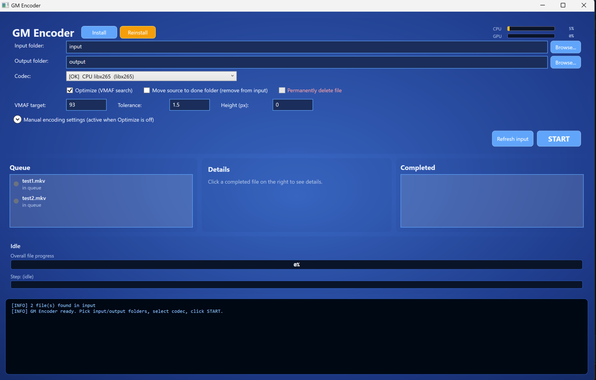
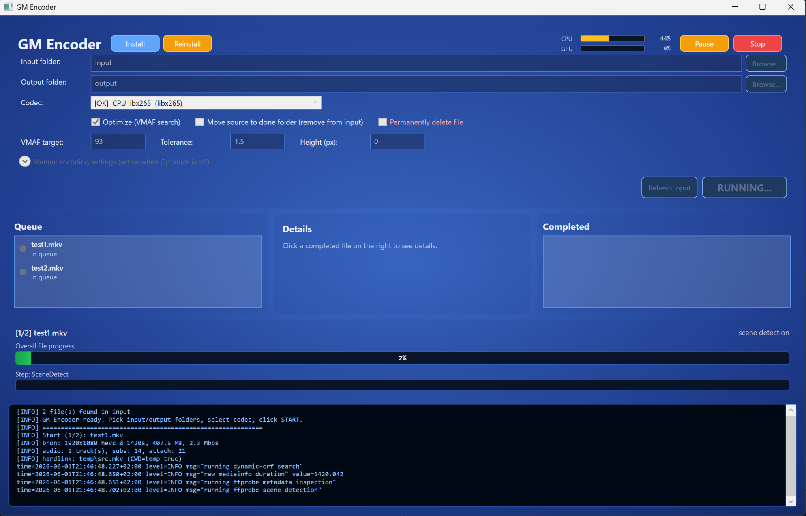

<p align="center">
  
</p>

# GM Encoder

A Windows GUI for [terranvigil/dynamic-crf](https://github.com/terranvigil/dynamic-crf) that wraps the VMAF-targeted encoding workflow with a polished interface. Patches the upstream Go source at install time to fix Windows path issues and add support for AMD/Intel hardware encoders.

Built with PowerShell + WPF, compiled to a single self-contained `.exe` (~160 KB) via [`ps2exe`](https://github.com/MScholtes/PS2EXE).

## Screenshots

### Idle — ready to encode
Pick input/output folders, choose a codec (12 options auto-detected), set VMAF target and tolerance, drop videos in `input\`, click START.



### Running — live progress + CPU/GPU usage
While encoding: live CPU/GPU usage bars in the header, phase-weighted overall progress, per-step indicator, and streaming console output from dynamic-crf + ffmpeg. Pause halts after the current file completes; Stop kills everything immediately via Job Object.



## Features

- **12 codec options** auto-detected from your ffmpeg build: H.264 / HEVC / AV1 × NVIDIA NVENC / AMD AMF / Intel QSV / CPU (libx264, libx265, SVT-AV1)
- **VMAF-targeted optimization** — finds optimal CRF via bisection on a 90-second sample (3-5 test encodes), then encodes the full video
- **Manual mode** — skip optimization, encode with specified CRF/QP directly
- **All audio/subtitles/attachments preserved** via post-mux step (rare in encoder GUIs)
- **Source disposal** options: keep, move to `input\done\`, or permanent delete (with confirm)
- **Pause / Stop** during encoding (Stop kills child ffmpeg via Windows Job Object)
- **Live progress** — overall + step bars, CPU/GPU usage monitoring, streaming log console
- **Settings persistence** — folders, codec, options remembered in `%APPDATA%\GmEncoder\settings.json`
- **One-click install** — embedded installer downloads Go, ffmpeg, MediaInfo, patches dynamic-crf source, builds the binary

## Attribution

This project is **NOT a fork** of dynamic-crf — it is a downstream Windows GUI wrapper that:
1. **Depends on** the upstream binary: clones [terranvigil/dynamic-crf](https://github.com/terranvigil/dynamic-crf) at install time, applies patches, builds with Go.
2. **Credits the upstream author**: all VMAF search / bisection / encoding orchestration logic is from terranvigil.

The PowerShell GUI (`gm-encoder.ps1`), encoder engine wrapper (`gui/Encoder.psm1`), build scripts and installer are original to this project. See [LICENSE](LICENSE) for our MIT-style attribution.

## Patches applied to dynamic-crf

The installer (`install-dynamic-crf.bat`) patches the upstream Go source before building, to fix Windows-specific issues and add hardware encoder support:

| Patch | File | What |
|---|---|---|
| 1 | `commands/cambi.go` + `cambi_windows.go` | `syscall.Mkfifo` is Unix-only → stub for Windows that returns error for `cambi` action |
| 2 | `commands/ffmpeg_encode.go` | Codec-aware quality flags: `cqp` (AMD AMF AV1, scaled qp ×5), `qvbr` (AMD HEVC/H.264), `cq` (NVENC AV1), `global_quality` (Intel QSV), `crf` (CPU codecs) |
| 3 | `actions/crf_search.go` | Duration heuristic threshold `< 1000ms` → `< 60000ms` so MKVs reporting seconds via MediaInfo get scaled correctly |
| 4 | `commands/ffprobe_scenes.go` | Escape Windows paths (`C:\` → `C:/`, escape colons + brackets) so the lavfi `movie=` filter works |

Without these patches, `dynamic-crf.exe` either fails to build on Windows, encodes at default quality (ignoring CRF) on AMD/Intel hardware, or crashes on paths containing `:`, `\`, `[`, `]`, or spaces.

## Install

### Single-exe usage (recommended)

1. Download `gm-gui.exe` from [Releases](../../releases)
2. Double-click → click **Install** button in the header
3. Wait ~5 min while the installer downloads ~500 MB (Go toolchain, ffmpeg, MediaInfo, git portable) into `bin\` and builds patched `dynamic-crf.exe`
4. Drop video files into `input\`, pick a codec, click **START**

### From source

```powershell
# Clone this repo
git clone https://github.com/<your-user>/gm-encoder
cd gm-encoder

# Build the .exe (requires PowerShell 5.1+, will install ps2exe module first time)
.\build-exe.ps1

# First-time setup
.\install-dynamic-crf.bat   # OR click Install in the GUI
```

## Usage

| Action | Result |
|---|---|
| Pick codec, enable Optimize, click START | Runs VMAF search on 90s sample → encodes full video at found CRF |
| Disable Optimize, enter CRF/QP manually | Skips search, encodes with specified quality |
| Pause | Halts after current file completes |
| Stop | Kills ffmpeg immediately, cancels queue |
| Click completed file | Shows details: codec, CRF, VMAF score, size in/out, ratio, duration |

Default settings: VMAF target 93, tolerance 1.5, CRF range 18-28, output as MKV with all original streams remuxed in.

## Build artifacts

- `gm-gui.exe` — main GUI, self-contained (PowerShell + WPF bundled via ps2exe)
- `dynamic-crf.exe` — patched build of upstream Go binary
- `bin\` — ffmpeg, ffprobe, MediaInfo, Go toolchain, git portable (~500 MB)

## Project layout

```
gm-encoder/
├── gm-encoder.ps1                 # Main GUI source (inline XAML + event wiring)
├── build-exe.ps1               # Bundles modules + ps2exe → gm-gui.exe
├── install-dynamic-crf.bat     # Installer + Go source patches
├── reinstall-dynamic-crf.bat   # Convenience: delete exe + reinstall
├── generate-handover.ps1       # Generates PROJECT-HANDOVER.md for AI context handover
├── gui/
│   ├── Encoder.psm1            # Per-file encoding pipeline (probe, hardlink, run dcrf, post-mux, cleanup)
│   └── _job-kill-on-close.ps1  # Win32 Job Object: child ffmpeg dies when GUI exits
└── archive/                    # Old CLI scripts (pre-GUI, kept for reference)
```

See [PROJECT-HANDOVER.md](PROJECT-HANDOVER.md) for a full architectural overview suitable for AI context transfer.

## Known limitations

- **AMD AMF on already-compressed sources** can produce *larger* output than the input. This is inherent AMF bit-inefficiency, not a bug. For pre-compressed content, prefer `libx265` (CPU) or `libsvtav1` (CPU) for actual compression gain.
- **AV1 on AMD RDNA 4** (RX 7000+/9000+) requires ffmpeg ≥ 7.0 and Adrenalin 24.x+ for hardware acceleration. Older combos fall back to slow CPU.
- **`cambi` action** is not supported on Windows (the upstream code uses named pipes via `mkfifo`, which doesn't exist on Windows).

## Not yet tested

The following code paths exist and the dropdown auto-detects them, but they have **not** been verified by the maintainer on real hardware:

- **NVIDIA NVENC** codecs (`h264_nvenc`, `hevc_nvenc`, `av1_nvenc`) — patches are applied, encoder availability is detected, but end-to-end encoding has not been run on an NVIDIA card.
- **Intel QSV** codecs (`h264_qsv`, `hevc_qsv`, `av1_qsv`) — patches are applied (`-global_quality` mapping), but no Intel Arc / iGPU testing has been done.
- **CPU libx264** and **libsvtav1** — work in theory and follow the upstream dynamic-crf default flow, but the maintainer primarily tested `libx265` and `hevc_amf` paths.

If you run these on your hardware and they work / don't work, please open an issue or PR so we can confirm and update this section.

## Contributors & Acknowledgments

- **[Turkushan](https://github.com/turkushan490)** — project owner, design, requirements, testing, deployment
- **[Claude](https://www.anthropic.com/claude)** (Anthropic) — AI pair-programming partner. Most of the source code (GUI scaffolding, encoder wrapper module, build pipeline, installer patches, error handling, threading model, settings persistence) was written collaboratively with Claude across many iterations of design, debugging and refactoring.

This project is an honest example of human + AI collaboration: the requirements, taste, real-world testing on AMD/NVIDIA hardware and final acceptance came from a human; the boilerplate, architectural patterns and a lot of the diagnostic work came from the AI. See [PROJECT-HANDOVER.md](PROJECT-HANDOVER.md) for the kind of context-handover document that lets a future AI session continue the work.

## Upstream credit

Big thanks to [**Terran Vigil**](https://github.com/terranvigil) for [dynamic-crf](https://github.com/terranvigil/dynamic-crf) — the VMAF-targeted bisection encoder that does the actual heavy lifting. This project would not exist without that work.

## License

MIT. See [LICENSE](LICENSE). Upstream `dynamic-crf` is also MIT-licensed by Terran Vigil — see [their LICENSE](https://github.com/terranvigil/dynamic-crf/blob/main/LICENSE).
